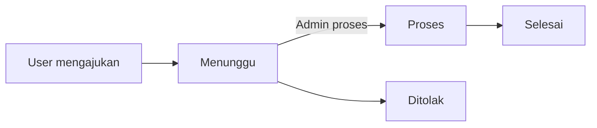
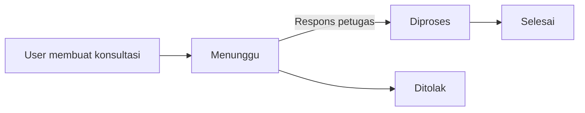
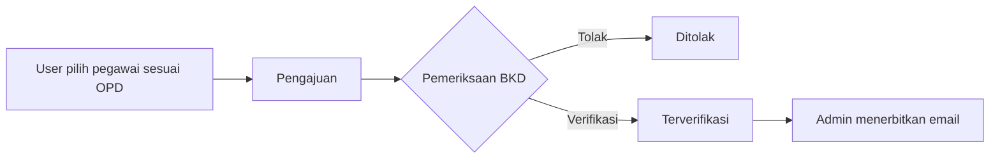

# Gelatik — Gerbang Layanan TIK Pemerintah Provinsi Lampung

Gelatik adalah platform layanan TIK terpadu untuk pegawai/OPD Pemerintah Provinsi Lampung. Sistem menyediakan aplikasi mobile Flutter, website Vue, REST API Laravel, database MySQL/MariaDB, serta service Node.js untuk Socket.IO dan WhatsApp.

> Dokumentasi kanonis repository. Snapshot source: **1 September 2026 (Asia/Jakarta)**, termasuk perubahan worktree yang belum di-commit. Source aktif, migration, dan automated test tetap menjadi sumber kebenaran tertinggi.

## Daftar Isi

- [Ringkasan sistem](#ringkasan-sistem)
- [Arsitektur](#arsitektur)
- [Role dan otorisasi](#role-dan-otorisasi)
- [Mobile Flutter](#mobile-flutter)
- [Website Vue](#website-vue)
- [Backend Laravel](#backend-laravel)
- [Backend Node.js](#backend-nodejs)
- [Database](#database)
- [Alur bisnis](#alur-bisnis)
- [Realtime, FCM, dan WhatsApp](#realtime-fcm-dan-whatsapp)
- [Tech stack](#tech-stack)
- [Struktur repository](#struktur-repository)
- [Konfigurasi dan menjalankan project](#konfigurasi-dan-menjalankan-project)
- [Pengujian](#pengujian)
- [Pembaruan terbaru](#pembaruan-terbaru)
- [Batasan dan risiko](#batasan-dan-risiko)
- [Dokumentasi lanjutan](#dokumentasi-lanjutan)

## Ringkasan sistem

Gelatik memusatkan kebutuhan berikut:

- autentikasi, profil, perubahan password, dan activity log;
- dashboard, kalender aktivitas, slider, dan pengumuman;
- peminjaman aset/perangkat TIK;
- konsultasi/helpdesk TIK dan respons petugas;
- informasi router, koneksi, dan bandwidth OPD/pengguna;
- pengajuan email resmi ASN dengan verifikasi BKD dan penerbitan admin;
- chatbot AI berbasis FAQ dengan fallback provider dan eskalasi konsultasi;
- kritik-saran, balasan admin, dan rating layanan;
- inbox notifikasi, realtime Socket.IO, FCM backend, dan WhatsApp opt-in;
- laporan peminjaman, konsultasi, dan usulan email dalam CSV/XLSX;
- manajemen user, role, permission, referensi layanan, dan pengaturan.

Empat role sistem adalah `user`, `bkd`, `admin`, dan `superadmin`. Laravel REST API dan database merupakan sumber kebenaran. Realtime hanya memberi sinyal perubahan agar client mengambil ulang data melalui REST.

## Arsitektur

```mermaid
flowchart LR
    M[Flutter Mobile] -->|REST + Passport| L[Laravel API]
    W[Vue Website] -->|REST + Passport| L
    M -. Socket.IO .-> N[Node Realtime/WA]
    W -. Socket.IO .-> N
    L --> D[(MySQL / MariaDB)]
    L -->|Internal API key| N
    N -->|Verifikasi token GET /api/me| L
    L -.-> F[Firebase Cloud Messaging]
    L -.-> A[Gemini / Groq]
    L -.-> S[SIMKI opsional]
    N -.-> WA[WhatsApp via Baileys]
```

Prinsip arsitektur:

1. Laravel menguasai autentikasi, validasi, otorisasi, transaksi, dan aturan bisnis.
2. MySQL/MariaDB menyimpan state durable.
3. Vue dan Flutter adalah client dan tidak menduplikasi aturan bisnis kritis.
4. Node tidak menggantikan Laravel; Node menangani Socket.IO dan gateway WhatsApp.
5. Event realtime membawa payload minimal, kemudian client melakukan refetch REST.
6. Kegagalan realtime, AI, FCM, SIMKI, atau WhatsApp non-OTP tidak boleh merusak transaksi utama.

## Role dan otorisasi

| Role | Kemampuan utama |
|---|---|
| `user` | Mengakses data dan layanan miliknya sendiri |
| `bkd` | Memeriksa, memverifikasi, atau menolak pengajuan email ASN |
| `admin` | Mengoperasikan layanan, merespons tiket, menerbitkan email, mengelola master data/laporan |
| `superadmin` | Seluruh kemampuan admin serta pengelolaan role dan akun istimewa |

Aturan penting:

- registrasi publik selalu menghasilkan role `user`;
- registrasi memerlukan NIP 18 digit, OPD, email resmi yang diizinkan, dan password minimal 8 karakter;
- akun hasil registrasi saat ini langsung aktif dan memperoleh access token;
- login menerima email, username, atau NIP; akun dengan `status != 1` ditolak;
- ownership dan policy backend melindungi data privat serta attachment;
- BKD tidak dapat menerbitkan alamat email resmi;
- admin/superadmin baru dapat menerbitkan email setelah verifikasi BKD;
- pembuatan admin melalui API hanya untuk superadmin;
- provisioning demo hanya tersedia pada environment `local` atau `testing`.

## Mobile Flutter

Lokasi: `gelatik-mobile/`

### Arsitektur mobile

Mobile memakai struktur feature-first, Riverpod untuk state/dependency injection, Dio untuk REST, Flutter Secure Storage untuk bearer token, SharedPreferences untuk cache persisten, dan Socket.IO client untuk invalidasi data realtime.

Scaffold tersedia untuk Android, iOS, web, Windows, Linux, dan macOS. Setiap target tetap memerlukan build, signing, konfigurasi, dan pengujian platform sebelum disebut production-ready.

### Fitur pengguna mobile

- splash dan pemulihan sesi;
- login email/username/NIP, registrasi, logout;
- lupa password, OTP WhatsApp, dan reset password;
- profil, edit profil, ganti password, activity log;
- dashboard bento, greeting, kalender, slider, pengumuman, dan shortcut;
- katalog layanan dan informasi aset;
- daftar, pencarian, pembuatan, detail, edit, dan pembatalan peminjaman;
- pemilihan banyak aset, cek stok/overlap, durasi hari/jam/menit, dan attachment;
- daftar, pembuatan, detail, respons, status, dan attachment konsultasi;
- daftar pegawai sesuai OPD dan pengajuan/detail email ASN;
- informasi router dan bandwidth OPD/pengguna;
- sumber bandwidth: alokasi akun, fallback router OPD, atau belum tersedia;
- self-assessment jaringan dan arah menuju konsultasi;
- chatbot native serta jalur WebView chatbot lama;
- kritik-saran, riwayat, balasan admin, dan nomor referensi;
- rating layanan;
- inbox notifikasi, read/read-all, dan snackbar realtime;
- status, subscribe, dan unsubscribe WhatsApp.

### Fitur admin mobile

- dashboard admin;
- daftar/detail dan perubahan status peminjaman;
- daftar/detail konsultasi;
- daftar/detail usulan email;
- moderasi kritik-saran.

Role BKD saat ini memperoleh tab admin generik, tetapi belum mempunyai portal BKD mobile khusus seperti website. Aksi tetap dibatasi backend.

### UI dan FCM mobile

Mobile memakai Material Design 3 light-only dengan gaya Bento Grid + Friendly Illustrative Civic. Warna utama navy `#1E3A8A`, gold `#F59E0B`, teal `#0F766E`, background `#F8FAFC`, dan border `#E2E8F0`. UI menggunakan komponen reusable dan ilustrasi Lampung/Muli-Meghanai.

Backend sudah dapat mengirim FCM melalui Kreait/Firebase Admin. Flutter belum memiliki dependency `firebase_messaging`; `FcmTopicService` masih simulasi in-memory/debug. Push FCM nyata ke device belum lengkap.

## Website Vue

Lokasi: `website/PKL-TIK-ADIT/`

Website adalah SPA Vue mandiri, bukan Blade, Inertia, Filament, atau backend kedua. Seluruh data bisnis berasal dari Laravel REST API.

### Halaman publik

- landing page layanan;
- login dan registrasi;
- lupa password, verifikasi OTP, dan reset password;
- halaman 404.

Autentikasi memakai `GovernmentAuthLayout` dengan identitas portal pemerintahan, trust indicators, panduan akun, dan ilustrasi Muli-Meghanai.

### Portal user `/app`

- dashboard, kalender, dan pengumuman;
- peminjaman dan konsultasi beserta detail;
- pengajuan email resmi dan detail;
- notifikasi, FAQ, router/bandwidth;
- rating, WhatsApp, chatbot, dan profil;
- form serta riwayat kritik-saran.

### Portal BKD `/bkd`

- dashboard antrean dan statistik;
- daftar/detail usulan email;
- verifikasi atau penolakan dokumen;
- notifikasi terkait usulan email;
- profil.

### Portal admin `/admin`

- dashboard KPI;
- pengelolaan peminjaman dan konsultasi;
- respons petugas dan perubahan status;
- penerbitan email setelah verifikasi BKD;
- user, aktivasi/nonaktivasi, role, permission;
- alokasi bandwidth khusus akun;
- notifikasi, kritik-saran, settings, dan pegawai;
- laporan peminjaman, konsultasi, dan usulan email;
- pengumuman serta CRUD item, topik, FAQ, slider, dan router.

### Routing, sesi, UI, dan realtime

- route di-lazy-load dan guard memeriksa autentikasi/role;
- stale Vite chunk dipulihkan dengan reload terkontrol;
- sesi disimpan per tab melalui session storage;
- Axios mengelola bearer token, response/error, dan cache;
- Socket.IO menginvalidasi resource lalu refetch REST;
- website tetap bekerja tanpa Socket.IO melalui REST load/refresh;
- Firebase Web Messaging/service worker belum tersedia;
- UI formal layanan publik memakai Urbanist lokal, semantic tokens, navy/gold/teal, focus ring, reduced-motion, shell responsif, sidebar desktop, dan bottom navigation mobile.

## Backend Laravel

Lokasi: `backend/`

Backend memakai PHP `^8.3` dan Laravel `^13.8`. Snapshot berisi 120 deklarasi route, 28 controller API, 23 service, dan 26 model Eloquent.

### Tanggung jawab

- Passport bearer authentication;
- Spatie role/permission dan ownership policy;
- request validation dan official email validation;
- transaksi, locking, stok, status transition, idempotency;
- akses database Eloquent/Query Builder;
- inbox notifikasi durable dan notification reads;
- integrasi FCM, Node, WhatsApp, AI, dan SIMKI;
- attachment terotorisasi;
- chatbot FAQ-first/RAG dan eskalasi konsultasi;
- laporan CSV/XLSX;
- audit aktivitas dan pengaturan aplikasi.

### Kelompok API

| Modul | Endpoint utama |
|---|---|
| Auth | `POST /login`, `/register`, `/forgot-password`, `/forgot-password/verify`, `/reset-password`, `/logout` |
| Akun | `GET/PATCH /me`, `POST /me/change-password`, `GET /me/activity-log` |
| Dashboard | `GET /dashboard`, `/dashboard/calendar`, `/slider`, `/pengumuman` |
| Peminjaman | CRUD `/pinjam`, status, item, dan attachment |
| Konsultasi | CRUD `/konsul`, response, status, dan attachment |
| Referensi | `/items`, `/topik`, `/faq`, `/opd`, `/pegawai`, `/list-router-opd` |
| Email ASN | CRUD `/pengajuan-email`, verifikasi, penerbitan, penolakan |
| Feedback | `/kritik-saran`, riwayat, admin reply/bulk-delete, `/rating` |
| Notifikasi | `/notifications`, read/read-all, CRUD notifikasi admin |
| WhatsApp | `/notifikasi/wa/status`, subscribe, unsubscribe |
| Chatbot | message, latest conversation, history, delete history, URL lama |
| Admin | dashboard, user, role, permission, settings, CRUD master data |
| Laporan | `/laporan/peminjaman`, `/laporan/{type}/data`, `/laporan/{type}/export` |

Route lengkap berada di `backend/routes/api.php` dan koleksi Postman di root.

### Chatbot AI

Chatbot menggunakan FAQ aktif sebagai pengetahuan utama, persona layanan TIK ketat, allow-list topik, deteksi prompt injection, konteks user read-only, dan history aman terbatas. Gemini adalah provider utama, Groq fallback, lalu jawaban lokal.

Setelah tiga saran gagal, chatbot menawarkan eskalasi `iya/tidak`. Jika iya, nama/OPD diambil dari profil dan detail insiden disusun dari keluhan terakhir. Tiket dibuat transactional dan idempotent. Jawaban tidak membatalkan penawaran tanpa membuat tiket.

## Backend Node.js

Lokasi: `realtime-service/`

Node memakai Express 5, Socket.IO 4, Axios, CORS, dotenv, QR terminal, dan Baileys. Service ini bukan penyimpan data bisnis.

Fungsinya:

- menyediakan koneksi Socket.IO terautentikasi;
- memverifikasi token ke `GET /api/me` Laravel;
- menempatkan socket ke room berdasarkan identitas server;
- menerima broadcast internal Laravel dengan API key;
- memvalidasi allow-list event dan payload minimal;
- menyediakan health check;
- menjalankan sesi/gateway WhatsApp Baileys.

Room tersedia: `user_{id}`, `role_admin`, dan `role_superadmin`. Tidak ada join-room dari client. BKD belum memiliki room role khusus dan memakai room user personal.

Event mencakup lifecycle peminjaman/konsultasi, `notification`, `kritik_saran.created`, `pengumuman.created`, lifecycle usulan email termasuk `usulan_email.verified`, event chatbot, `data.sync`, dan `insights.sync`. Token, password, authorization, objek user penuh, attachment, dan raw row dilarang dalam payload.

## Database

Database memakai MySQL/MariaDB dengan gabungan schema legacy `backend/database/schema_lengkap.sql` dan migration incremental. Jangan menjalankan `migrate:fresh` pada database existing.

| Kelompok | Tabel/entitas utama |
|---|---|
| Identitas/RBAC | `users`, roles, permissions, relasi Spatie, activity/audit log |
| OAuth/reset | tabel Passport, `password_reset_tokens`, `password_reset_otps` |
| Peminjaman | master item, transaksi permintaan pinjam, relasi item, return proof |
| Konsultasi | `master_topik`, `faq`, transaksi dan response konsultasi |
| Email ASN | pegawai/belum punya email, usulan, verifikasi/penerbitan |
| Internet | router, router per OPD, bandwidth router dan user |
| Notifikasi | notification, notification reads, target/broadcast |
| WhatsApp | subscriptions dan delivery logs |
| Chatbot | conversations, messages, state eskalasi |
| Konten/feedback | slider, pengumuman, settings, rating, kritik-saran |
| Infrastruktur | cache, queue/jobs, session database, audit logs |

Migration incremental mencakup WhatsApp, chatbot, NIP, cache, notification reads, reset OTP, bandwidth router, admin audit, reply feedback, indeks realtime, serta bandwidth user.

Migration terbaru menambahkan `bandwidth_download_mbps` dan `bandwidth_upload_mbps` nullable pada `users`. Bila tidak ada alokasi khusus, bandwidth router OPD menjadi fallback.

## Alur bisnis

### Peminjaman aset



Stok diperiksa terhadap overlap. Edit, tambah/hapus item, dan pembatalan user hanya saat `Menunggu`. Perubahan status menghasilkan notifikasi dan event realtime.

### Konsultasi TIK



Respons pertama dapat mengubah `Menunggu` menjadi `Diproses`. User hanya dapat melihat tiket miliknya.

### Pengajuan email ASN



Penerbitan sebelum verifikasi ditolak backend. Transaction/locking mencegah race condition.

## Realtime, FCM, dan WhatsApp

| Teknologi | Fungsi | Bila tidak tersedia |
|---|---|---|
| Socket.IO | Update cepat saat aplikasi aktif | REST tetap jalan; update muncul setelah refetch/refresh/polling |
| FCM | Push saat mobile background/tertutup | Transaksi tetap jalan, tetapi push background tidak sampai |
| WhatsApp | OTP reset dan notifikasi opt-in | Notifikasi opsional dapat gagal; reset OTP bergantung kanal ini |

Tanpa Socket.IO, mobile dan website tetap dapat digunakan karena REST adalah sumber data, tetapi kehilangan update foreground instan. Tanpa FCM, fitur inti tetap berjalan tetapi push background/closed-app tidak ada. Untuk notifikasi penuh lintas kondisi, Socket.IO dan implementasi FCM client nyata sebaiknya dipakai bersama.

## Tech stack

### Mobile

| Teknologi | Fungsi |
|---|---|
| Flutter/Dart | UI multi-platform |
| Riverpod | State dan dependency injection |
| Dio | REST client dan interceptor |
| Secure Storage | Penyimpanan token |
| SharedPreferences | Cache persisten |
| Socket.IO Client | Realtime foreground |
| WebView/File Picker | Kompatibilitas web dan attachment |
| Intl/Google Fonts/SVG | Format dan visual |

### Website

| Teknologi | Fungsi |
|---|---|
| Vue 3 | Component UI reaktif |
| Vite 7 | Dev server dan bundler |
| Vue Router | Routing/guard |
| Pinia | State auth |
| Axios | REST client |
| Socket.IO Client | Invalidasi realtime |
| Tailwind/Heroicons | Styling dan ikon |
| ESLint/Prettier | Kualitas source |

### Laravel

| Teknologi | Fungsi |
|---|---|
| PHP 8.3 + Laravel 13.8 | REST API dan business logic |
| Passport | OAuth2 bearer token |
| Spatie Permission/Activitylog | RBAC dan audit |
| Kreait Firebase | FCM backend |
| Laravel Excel | CSV/XLSX |
| Snappy | PDF bila wkhtmltopdf dikonfigurasi |
| Yajra DataTables | Listing/query server-side |
| PHPUnit | Automated test |

### Node/infrastruktur

| Teknologi | Fungsi |
|---|---|
| Express 5 | HTTP internal/health |
| Socket.IO 4 | Realtime |
| Baileys | WhatsApp gateway |
| MySQL/MariaDB | Database relasional |
| Firebase | Push backend |
| Gemini/Groq | Chatbot AI |
| SIMKI | Integrasi opsional |

## Struktur repository

```text
backend-gelatik/
├── backend/                         # Laravel API dan database
├── gelatik-mobile/                  # Flutter application
├── website/PKL-TIK-ADIT/           # Vue SPA
├── realtime-service/                # Node Socket.IO + WhatsApp
├── docs/                            # Dokumen teknis/audit
├── layanantik-backend-api.postman_collection.json
├── KONFIGURASI_PRODUCTION.md
├── PENGETAHUAN_LENGKAP_DAN_PROMPT_PROJECT_GELATIK.md
├── PROMPT_DOKUMENTASI_WORD_PROJECT_GELATIK.md
└── README.md                        # Dokumentasi kanonis
```

Footprint snapshot: 120 route declarations, 28 controller API, 23 service Laravel, 26 model Eloquent, 37 view Vue, dan 43 screen Flutter.

## Konfigurasi dan menjalankan project

### Prasyarat

- PHP 8.3, Composer 2, dan ekstensi PHP terkait;
- MySQL 8+ atau MariaDB kompatibel;
- Node.js 20.19+ atau 22.12+;
- Flutter SDK dengan Dart kompatibel `^3.12.2`;
- wkhtmltopdf bila fitur Snappy digunakan.

### Laravel

```bash
cd backend
composer install
cp .env.example .env
php artisan key:generate
php artisan passport:keys
php artisan migrate
php artisan serve
```

Laravel default: `http://127.0.0.1:8000`.

### Node realtime/WhatsApp

```bash
cd realtime-service
cp .env.example .env
npm install
npm start
```

`INTERNAL_SERVICE_API_KEY` harus sama dengan Laravel. Node default: `http://127.0.0.1:4000`.

### Website

```bash
cd website/PKL-TIK-ADIT
cp .env.example .env
npm install
npm run dev
```

```env
VITE_API_BASE_URL=http://127.0.0.1:8000/api
VITE_REALTIME_URL=http://127.0.0.1:4000
VITE_ENABLE_REALTIME=true
```

Jangan menaruh secret pada `VITE_*`; nilainya terlihat di browser.

### Flutter

```bash
cd gelatik-mobile
flutter pub get
flutter run
```

Sesuaikan base URL untuk emulator/device; `127.0.0.1` pada device tidak selalu menunjuk komputer development.

Secret production (database, Passport, internal key, Firebase, AI, WhatsApp, SIMKI, CORS) hanya disimpan di server. Lihat `KONFIGURASI_PRODUCTION.md`. Jangan commit `.env`, private key, token, sesi WhatsApp, atau dump sensitif.

## Pengujian

```bash
# Laravel
cd backend
php artisan test

# Node
cd realtime-service
npm test

# Website
cd website/PKL-TIK-ADIT
npm run format:check
npm run lint
npm run build

# Flutter
cd gelatik-mobile
flutter analyze
flutter test
```

Status audit 31 Agustus 2026: build website berhasil; Node 15/15 test lulus; Laravel unit 21/21 lulus (46 assertions); feature test Laravel terkendala PDO SQLite pada PHP CLI audit; Flutter test tidak memberi progres pada environment audit dan dihentikan. Keterbatasan environment bukan bukti source gagal.

## Pembaruan terbaru

### Source aktif 1 September 2026

- redesign website: landing, autentikasi resmi, shell, sidebar, dashboard, dan halaman role;
- `GovernmentAuthLayout`, aset pemerintah/Diskominfotik, dan ilustrasi Muli-Meghanai;
- refactor widget auth/profil mobile serta shell/search/header/WhatsApp;
- bandwidth download/upload khusus user yang dapat diatur admin;
- fallback bandwidth dari router OPD dan label sumber;
- dashboard/profil/internet mobile menampilkan bandwidth personal;
- password registrasi minimum 8 karakter;
- eskalasi chatbot setelah tiga saran gagal dengan konfirmasi `iya/tidak`;
- detail tiket chatbot memakai profil dan keluhan terakhir;
- `usulan_email.verified` masuk allow-list Node;
- perluasan test backend, Node, dan mobile.

### Commit 31 Agustus 2026

- redesign mobile civic formal, bento dashboard, persistent shell, Services screen;
- bandwidth, slider/pengumuman, pencarian aset, form, dan ilustrasi lokal.

### Commit 30 Agustus 2026

- portal BKD dan workflow email dua tahap;
- validasi official domain, filter pegawai OPD, pagination/filter;
- cache persisten dan design system mobile.

### Commit 25–26 Agustus 2026

- chatbot FAQ-first, provider fallback, history, dan eskalasi;
- stabilisasi realtime, cache, notifikasi, WhatsApp, feedback, dan slider.

## Batasan dan risiko

- Flutter belum memasang `firebase_messaging`; FCM mobile masih simulasi.
- Website belum memiliki Firebase Web Messaging/service worker.
- Room role Socket.IO khusus BKD belum ada.
- Mobile belum mempunyai portal BKD khusus.
- database session membutuhkan tabel `sessions` bila driver tersebut digunakan.
- `.env.example` harus diaudit terhadap seluruh key runtime.
- Gemini, Groq, Firebase, SIMKI, WhatsApp, dan jaringan bergantung layanan eksternal.
- schema legacy dan migration incremental harus dikelola hati-hati.
- perubahan bandwidth, chatbot, dan redesign terbaru masih worktree pada snapshot ini.
- kesiapan setiap target Flutter wajib dibuktikan lewat build/test target.

## Dokumentasi lanjutan

- [Pengetahuan lengkap dan prompt project](PENGETAHUAN_LENGKAP_DAN_PROMPT_PROJECT_GELATIK.md)
- [Prompt dokumentasi Word](PROMPT_DOKUMENTASI_WORD_PROJECT_GELATIK.md)
- [Konfigurasi production](KONFIGURASI_PRODUCTION.md)
- [IDDS upgrade](docs/IDDS_UPGRADE.md)
- [Realtime event registry](docs/realtime-event-registry.md)
- [Stability and fetching audit](docs/stability-and-fetching-audit.md)
- [Performance audit](docs/PERFORMANCE_AUDIT.md)
- [Postman Collection](layanantik-backend-api.postman_collection.json)

README subproject hanya menjadi penunjuk ke dokumen ini agar informasi tidak terduplikasi dan tidak berbeda antar-komponen.
