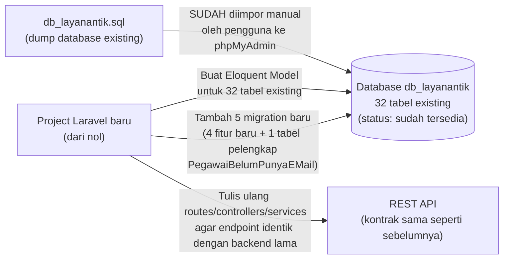

# 📄 Product Requirements Document (PRD) — Pembangunan Ulang Backend dari Nol (Database Existing)

## 0. Informasi Dokumen

| Item | Detail |
|---|---|
| **Nama Dokumen** | PRD — Pembangunan Backend Baru di Atas Database Existing |
| **Versi Dokumen** | 3.0 (revisi dari `prd_backend_terpadu.md` v1.0 dan `prd_backend_baru.md` v2.0) |
| **Perubahan dari v2.0 ke v3.0** | (1) Nama database dikoreksi menjadi **`db_layanantik`** (bukan `wagyua5_ultigord` yang merupakan nama internal pada dump asli — pengguna telah mengimpornya secara manual ke phpMyAdmin dengan nama database `db_layanantik`); (2) Database **sudah diimpor oleh pengguna sendiri**, bukan lagi langkah yang perlu dilakukan Antigravity; (3) Ditambahkan **1 tabel baru** yang sebelumnya tidak ada di dump (`PegawaiBelumPunyaEMail`) — lihat §4.1. |
| **Perubahan dari v1.0 ke v2.0** | v1.0 mengasumsikan project Laravel existing sudah ada di direktori kerja. v2.0 mengasumsikan codebase Laravel dibangun dari nol, database memakai data existing yang di-*import* apa adanya. |
| **Dasar Analisis** | `prd_backend_terpadu.md`, `srs_backend_terpadu.md` (v1.0), serta skema aktual hasil ekstraksi `db_layanantik.sql` |
| **Prinsip Utama** | *Kode baru, data lama*: seluruh codebase (routes, controller, service, model) ditulis ulang dari nol, tetapi **kontrak endpoint API dan struktur database dipertahankan identik** dengan backend lama, ditambah tabel & endpoint baru khusus fitur tambahan |

---

## 1. Ringkasan Eksekutif

Dokumen ini merevisi strategi pembangunan backend terpadu yang sebelumnya didefinisikan di `prd_backend_terpadu.md`. Perbedaan mendasarnya:

| Aspek | v1.0 (Sebelumnya) | v2.0 (Dokumen Ini) |
|---|---|---|
| Codebase Laravel | Diasumsikan sudah ada, tinggal ditambah fitur baru | **Dibangun dari nol** (project Laravel baru) |
| Database | Diasumsikan sudah ada & terhubung | **Di-*import* langsung dari `db_layanantik.sql`** ke database baru (`db_layanantik`) |
| Struktur tabel existing | Tidak dibahas detail | **32 tabel existing** dipetakan eksplisit ke Eloquent Model baru (lihat §4) |
| Endpoint API | Union dari 2 dokumen asal | **Tetap sama** — kontrak endpoint yang harus direplikasi ulang di codebase baru |
| Fitur baru (F-WA, F-BOT, F-LAPORAN, F-RT) | Tetap sama | **Tidak berubah** — tetap merujuk ke `prd_backend_terpadu.md` §7 untuk detail fitur |

Tujuan akhirnya tetap sama seperti v1.0: satu backend (Laravel + Node.js) yang melayani Website Layanan TIK dan UltiMobile Gelatik secara bersamaan dan real-time — **hanya jalur pembangunannya yang berubah**: bukan mengembangkan dari codebase lama, melainkan menulis ulang backend dari nol di atas data yang sudah ada.

---

## 2. Latar Belakang & Alasan Perubahan Strategi

Pemilik produk memutuskan untuk **membangun backend benar-benar baru** (bukan melanjutkan codebase lama yang sudah ada), dengan pertimbangan:
1. Codebase lama tidak tersedia/tidak ingin dipakai sebagai titik awal pengembangan.
2. Database existing (`db_layanantik.sql`) tetap harus dipakai apa adanya — data produksi (pengguna, riwayat peminjaman, konsultasi, dsb.) **tidak boleh hilang atau direset**.
3. Backend baru harus tetap **kompatibel penuh** dengan 2 klien yang sudah berjalan (Website & Mobile), sehingga kontrak endpoint API wajib direplikasi persis, meski implementasi kodenya baru.

### Prinsip Kerja: "Kode Baru, Data Lama"

> **Status terkini**: database `db_layanantik` **sudah diimpor** oleh pengguna sendiri ke phpMyAdmin. Langkah "import database" pada roadmap (§7) sudah selesai — tidak perlu lagi dilakukan Antigravity.

---

## 3. Ruang Lingkup

### 3.1 Dalam Lingkup
- Membuat project Laravel baru dari nol (`composer create-project laravel/laravel`).
- Meng-*import* `db_layanantik.sql` ke database MySQL baru bernama `db_layanantik` (nama dipertahankan sesuai dump asli, agar tidak ada kejutan penamaan di kemudian hari).
- Membuat Eloquent Model untuk **seluruh 32 tabel existing** (lihat §4), termasuk penyesuaian nama tabel non-konvensional Laravel (mis. `tr_permintaan_pinjam`, `m_settings`).
- Menulis ulang routes, controllers, dan service layer agar **endpoint API yang diekspos identik** dengan yang sudah dikonsumsi Website dan Mobile saat ini (path, method, request/response contract).
- Setup Laravel Passport untuk autentikasi API (tabel `oauth_*` sudah tersedia di dump, tinggal dikonfigurasi).
- Menambahkan 5 tabel baru via migration (bukan bagian dari dump): `whatsapp_subscriptions`, `whatsapp_delivery_logs`, `chatbot_conversations`, `chatbot_messages`, `PegawaiBelumPunyaEMail`.
- Setup service Node.js terpisah (Realtime & Integration Service) — tidak berubah dari `prd_backend_terpadu.md` §4–§5.

### 3.2 Di Luar Lingkup
- Mengubah struktur 32 tabel existing (kolom, tipe data, relasi) — struktur dump dipertahankan apa adanya.
- Migrasi data ke database engine lain (tetap MySQL).
- Menulis ulang detail fitur F-WA/F-BOT/F-LAPORAN/F-RT — spesifikasi fiturnya **tidak berubah**, cukup rujuk `prd_backend_terpadu.md` §7 dan `srs_backend_terpadu.md` §5.

---

## 4. Pemetaan 32 Tabel Existing ke Modul Fungsional

> Diekstrak langsung dari `db_layanantik.sql` (database `db_layanantik`). Ini adalah **fakta dari file yang diupload**, bukan asumsi.

| Modul | Tabel Terkait |
|---|---|
| **M-01 Autentikasi & Otorisasi** | `users`, `roles`, `permissions`, `model_has_roles`, `model_has_permissions`, `role_has_permissions`, `personal_access_tokens`, `password_resets`, `oauth_clients`, `oauth_access_tokens`, `oauth_auth_codes`, `oauth_refresh_tokens`, `oauth_personal_access_clients` |
| **M-02 Dashboard** | `sliders` |
| **M-03 Peminjaman Aset TIK** | `master_item`, `tr_permintaan_pinjam`, `pinjam_item` |
| **M-04 Konsultasi TIK** | `tr_konsultasi`, `tr_konsultasi_response`, `master_topik` |
| **M-05 Layanan Internet** | `unker_list_router`, `unker_router` |
| **M-06 Usulan Email Resmi** | `usulan_email`, **`PegawaiBelumPunyaEMail`** 🆕 (tabel pelengkap — sumber data pegawai yang belum memiliki email resmi, dikonsumsi oleh endpoint `GET /api/pegawai`; tabel ini **tidak ada di dump asli**, harus dibuat baru — lihat §4.1) |
| **M-07 FAQ & Topik** | `faq`, `master_topik` (dipakai bersama M-04) |
| **M-08 Kritik & Saran** | `kritik_sarans` |
| **M-09 Rating** | `ratings` |
| **M-10 Pengumuman** | `pengumumans` |
| **M-11 Chatbot AI Lama (Chatbase)** | `chatbot_urls` (konfigurasi URL widget) |
| **M-12 Panel Admin & Pengaturan** | `m_settings`, `notification`, `activity_log` |
| **Infrastruktur Laravel** | `migrations`, `jobs`, `failed_jobs` |
| **🆕 Fitur Baru (belum ada di dump, ditambah via migration)** | `whatsapp_subscriptions`, `whatsapp_delivery_logs`, `chatbot_conversations`, `chatbot_messages`, `PegawaiBelumPunyaEMail` |

### 4.1 🆕 Detail Tabel Tambahan: `PegawaiBelumPunyaEMail`

> Tabel ini **bukan bagian dari dump `db_layanantik.sql`** — sebelumnya data ini kemungkinan diakses lewat query lintas-database ke sistem BKD. Sesuai permintaan, tabel ini dibuat langsung di database `db_layanantik` dengan struktur berikut (diambil persis dari struktur yang diberikan):

| Kolom | Tipe | Null | Default | Catatan |
|---|---|---|---|---|
| `ID_Peg` | varchar(32) | **Tidak** (NOT NULL) | — | Diasumsikan sebagai Primary Key (satu-satunya kolom NOT NULL tanpa default) — **lihat asumsi di SRS §4.1** |
| `NIP_Baru` | varchar(24) | Ya | NULL | Nomor Induk Pegawai baru |
| `Nama` | varchar(117) | Ya | NULL | Nama lengkap pegawai |
| `Unit_Kerja` | varchar(255) | Ya | — | Nama unit kerja |
| `NJab` | varchar(255) | Ya | NULL | Nama jabatan |
| `NUnKer` | varchar(255) | Ya | NULL | Nama unit kerja (versi lain/detail) |
| `EmailUsulan` | varchar(35) | Ya | NULL | **Email rekomendasi/usulan dari sistem** (bukan email final) |
| `EmailPribadi` | varchar(150) | Ya | NULL | Email pribadi pegawai (jika ada) |

**Aturan tampilan/response API**: saat data tabel ini ditampilkan melalui endpoint `GET /api/pegawai` (atau endpoint lain yang memakainya), **seluruh field ditampilkan KECUALI `ID_Peg`** — kolom tersebut disembunyikan dari response API/tampilan UI, hanya dipakai secara internal sebagai identifier.

> **Catatan penting**: tabel `jobs` dan `failed_jobs` **sudah ada** di database existing — artinya backend lama sudah didesain untuk memakai Laravel Queue. Ini sangat menguntungkan untuk implementasi F-WA (pengiriman WA sebaiknya lewat Queue Job, bukan sinkron) dan F-RT (broadcast event bisa di-dispatch sebagai job juga). Tabel `activity_log` mengonfirmasi backend lama **sudah memakai Spatie Laravel ActivityLog** — dipertahankan untuk audit F-WA/F-LAPORAN sesuai keputusan di dokumen v1.0.

---

## 5. Strategi Teknis Pembangunan Ulang

### 5.1 Kenapa Import Dump, Bukan Migration Ulang?
Menulis ulang 32 tabel existing menjadi file migration Laravel dari nol **berisiko tinggi**: kemungkinan ada detail kolom/index/constraint yang terlewat dibanding struktur asli, dan tidak ada jaminan data lama (user, riwayat peminjaman, dsb.) bisa dipindahkan dengan aman. Strategi yang lebih aman:
1. **Import `db_layanantik.sql` langsung** ke database baru menggunakan `mysql` client (bukan `php artisan migrate`) — menjamin struktur dan data 100% identik dengan sumber asli.
2. Laravel baru **tidak perlu membuat migration untuk 32 tabel existing** — cukup buat Eloquent Model yang menunjuk ke tabel-tabel tersebut.
3. Migration Laravel **hanya dibuat untuk 5 tabel baru** (4 fitur tambahan + 1 tabel pelengkap PegawaiBelumPunyaEMail), karena tabel-tabel ini memang belum ada di database mana pun.

### 5.2 Penyesuaian Nama Tabel Non-Konvensional
Laravel secara default mengasumsikan nama tabel adalah bentuk jamak snake_case dari nama model (mis. model `User` → tabel `users`). Beberapa tabel di dump **tidak mengikuti pola ini** dan wajib didefinisikan eksplisit lewat properti `protected $table` di Model:

| Model Laravel | Properti `$table` yang harus diset |
|---|---|
| `Pinjam` | `tr_permintaan_pinjam` |
| `Konsultasi` | `tr_konsultasi` |
| `KonsultasiResponse` | `tr_konsultasi_response` |
| `Setting` | `m_settings` |
| `RouterList` | `unker_list_router` |
| `Router` | `unker_router` |
| `KritikSaran` | `kritik_sarans` (jamak tidak standar — tetap perlu dicek konsisten) |
| `Pengumuman` | `pengumumans` |
| `Notification` (custom, bukan bawaan Laravel) | `notification` (singular — beda dari konvensi Laravel yang biasanya jamak) |
| `ChatbotUrl` | `chatbot_urls` |

---

## 6. Fitur Baru & Arsitektur

**Tidak berubah dari `prd_backend_terpadu.md`.** Backend baru ini tetap mengimplementasikan:
- **F-WA** (Notifikasi Real-time WhatsApp) — lihat `prd_backend_terpadu.md` §7.1
- **F-BOT** (Chatbot Native, platform-agnostic) — §7.2
- **F-LAPORAN** (Laporan Rangkuman Peminjaman, ekspos ke API) — §7.3
- **F-RT** (Real-time Synchronization Layer via Node.js Socket.io) — §7.4

Arsitektur Laravel + Node.js juga **tidak berubah** — lihat `srs_backend_terpadu.md` §3 untuk diagram komponen lengkap.

---

## 7. Roadmap Pembangunan Ulang

```mermaid
flowchart LR
    A["Fase 1<br/>Setup Project Laravel Baru<br/>dari Nol"] --> B["Fase 2<br/>Verifikasi Database db_layanantik<br/>(sudah diimpor pengguna)"]
    B --> C["Fase 3<br/>Buat Eloquent Model<br/>untuk 32 Tabel Existing"]
    C --> D["Fase 4<br/>Setup Passport +<br/>Tulis Ulang Routes/Controllers<br/>(kontrak endpoint identik)"]
    D --> E["Fase 5<br/>Migration 4 Tabel Baru<br/>(F-WA & F-BOT)"]
    E --> F["Fase 6<br/>Setup Node.js<br/>Realtime & WA Gateway"]
    F --> G["Fase 7<br/>Implementasi F-WA, F-BOT,<br/>F-LAPORAN, F-RT"]
    G --> H["Fase 8<br/>Integrasi Ulang<br/>Website & Mobile ke Backend Baru"]
    H --> I["Fase 9<br/>QA Regresi Menyeluruh<br/>(bandingkan dgn kontrak lama)"]
    I --> J["Fase 10<br/>Rilis"]
```

---

## 8. Risiko Khusus Strategi Ini

| Risiko | Dampak | Mitigasi |
|---|---|---|
| Import SQL dump gagal sebagian (kolom/index tidak sesuai versi MySQL/MariaDB tujuan) | Data tidak lengkap/struktur tabel berbeda dari sumber | Cek versi MySQL/MariaDB tujuan kompatibel dengan dump; lakukan `mysqldump --compatible` bila perlu; verifikasi jumlah baris per tabel setelah import |
| Model baru salah menunjuk nama tabel non-konvensional | Error "table not found" atau salah membaca data | Gunakan tabel pemetaan di §5.2 sebagai checklist saat membuat setiap Model |
| Endpoint hasil tulis ulang tidak 100% identik dengan versi lama (field hilang/beda urutan) | Website/Mobile existing gagal terhubung ke backend baru | Wajib ada *contract testing* — bandingkan response backend baru vs lama untuk setiap endpoint sebelum rilis |
| Password hash user existing tidak kompatibel bila algoritma hashing Laravel baru berbeda versi | User existing tidak bisa login | Pastikan konfigurasi hashing (`config/hashing.php`) di project baru sama dengan yang dipakai backend lama (biasanya bcrypt, tapi wajib diverifikasi) |

---

## 9. Ringkasan

> Dokumen ini merevisi strategi pembangunan backend terpadu: alih-alih melanjutkan codebase Laravel yang sudah ada, backend dibangun **benar-benar baru dari nol**, sementara **database tetap memakai data existing** (`db_layanantik.sql`, 32 tabel, database `db_layanantik`) yang di-*import* apa adanya — bukan direkonstruksi lewat migration. Kontrak endpoint API wajib direplikasi identik di codebase baru, ditambah 5 tabel baru khusus fitur tambahan (F-WA, F-BOT) dan 1 tabel pelengkap (PegawaiBelumPunyaEMail). Spesifikasi fitur baru (F-WA, F-BOT, F-LAPORAN, F-RT) dan arsitektur Laravel+Node.js tidak berubah dari `prd_backend_terpadu.md`/`srs_backend_terpadu.md` — dokumen ini murni fokus pada **perubahan strategi pembangunan**, bukan perubahan kebutuhan fungsional.
