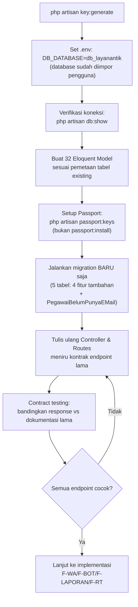

# 📘 Software Requirements Specification (SRS) — Pembangunan Ulang Backend dari Nol (Database Existing)

## 0. Informasi Dokumen

| Item | Detail |
|---|---|
| **Nama Dokumen** | SRS — Pembangunan Backend Baru di Atas Database Existing |
| **Versi Dokumen** | 2.0 (revisi dari `srs_backend_terpadu.md` v1.0) |
| **Terkait Dokumen** | `prd_backend_baru.md`, `prd_backend_terpadu.md`, `srs_backend_terpadu.md`, `db_layanantik.sql` |

---

## 1. Pendahuluan

### 1.1 Tujuan
Menjabarkan kebutuhan teknis rinci untuk membangun backend Laravel + Node.js dari nol, yang terhubung ke database existing (`db_layanantik.sql`) tanpa mengubah strukturnya, sekaligus mereplikasi kontrak API yang sudah dikonsumsi Website Layanan TIK dan UltiMobile Gelatik.

### 1.2 Ruang Lingkup
Dokumen ini **melengkapi** (bukan menggantikan) `srs_backend_terpadu.md` v1.0 — seluruh spesifikasi F-WA, F-BOT, F-LAPORAN, F-RT tetap berlaku. Fokus dokumen ini murni pada:
- Prosedur setup database dari dump SQL
- Spesifikasi 32 tabel existing & pemetaan Model
- Migration baru yang harus dibuat
- Strategi verifikasi kontrak API pasca pembangunan ulang

---

## 2. Spesifikasi Database Existing

### 2.1 Informasi Umum

| Item | Detail |
|---|---|
| Nama database | `db_layanantik` |
| Jumlah tabel | 32 |
| Sumber | `db_layanantik.sql` (dump SQL, diupload pengguna) |
| Engine | MySQL/MariaDB (perlu verifikasi versi saat import) |

### 2.2 Status Import Database

> ✅ **Sudah selesai dilakukan pengguna secara manual** melalui phpMyAdmin — database `db_layanantik` sudah berisi 32 tabel existing. Langkah ini **tidak perlu diulang** oleh Antigravity. Cukup lakukan verifikasi berikut sebelum lanjut ke tahap berikutnya:

```bash
# Verifikasi jumlah tabel (harus = 32)
mysql -u root -p db_layanantik -e "SHOW TABLES;" | wc -l

# Verifikasi koneksi Laravel ke database ini berhasil (setelah .env dikonfigurasi)
php artisan db:show
```

> **Wajib diverifikasi**: jumlah baris di tabel penting (`users`, `tr_permintaan_pinjam`, `tr_konsultasi`) sesuai ekspektasi, memastikan tidak ada data yang hilang saat proses import manual sebelumnya.

### 2.3 Daftar Lengkap 32 Tabel (Fakta dari Dump)

| # | Tabel | Kategori |
|---|---|---|
| 1 | `users` | Auth |
| 2 | `roles` | Auth (Spatie Permission) |
| 3 | `permissions` | Auth (Spatie Permission) |
| 4 | `model_has_roles` | Auth (Spatie Permission) |
| 5 | `model_has_permissions` | Auth (Spatie Permission) |
| 6 | `role_has_permissions` | Auth (Spatie Permission) |
| 7 | `personal_access_tokens` | Auth (Sanctum, jika dipakai berdampingan dgn Passport) |
| 8 | `password_resets` | Auth |
| 9 | `oauth_clients` | Auth (Passport) |
| 10 | `oauth_access_tokens` | Auth (Passport) |
| 11 | `oauth_auth_codes` | Auth (Passport) |
| 12 | `oauth_refresh_tokens` | Auth (Passport) |
| 13 | `oauth_personal_access_clients` | Auth (Passport) |
| 14 | `sliders` | Dashboard |
| 15 | `master_item` | Peminjaman Aset |
| 16 | `tr_permintaan_pinjam` | Peminjaman Aset |
| 17 | `pinjam_item` | Peminjaman Aset (pivot) |
| 18 | `tr_konsultasi` | Konsultasi TIK |
| 19 | `tr_konsultasi_response` | Konsultasi TIK |
| 20 | `master_topik` | Konsultasi & FAQ |
| 21 | `faq` | FAQ |
| 22 | `unker_list_router` | Layanan Internet |
| 23 | `unker_router` | Layanan Internet |
| 24 | `usulan_email` | Usulan Email Resmi |
| 25 | `kritik_sarans` | Kritik & Saran |
| 26 | `ratings` | Rating |
| 27 | `pengumumans` | Pengumuman |
| 28 | `chatbot_urls` | Chatbot AI Lama |
| 29 | `m_settings` | Pengaturan Umum |
| 30 | `notification` | Notifikasi In-App |
| 31 | `activity_log` | Audit Trail (Spatie ActivityLog) |
| 32 | `migrations`, `jobs`, `failed_jobs` | Infrastruktur Laravel (Queue sudah dipakai backend lama) |

---

## 3. Kebutuhan Fungsional — Setup Model & Kompatibilitas

| ID | Requirement |
|---|---|
| FR-B01 | Sistem harus memiliki Eloquent Model untuk seluruh 32 tabel existing, dengan properti `$table` eksplisit untuk tabel yang tidak mengikuti konvensi penamaan Laravel (lihat `prd_backend_baru.md` §5.2). |
| FR-B02 | Sistem harus mengonfigurasi Laravel Passport menggunakan tabel `oauth_*` yang sudah ada di dump (bukan generate ulang via `passport:install` yang akan membuat client baru) — cukup jalankan `passport:keys` untuk generate keypair enkripsi, dan pastikan `oauth_clients` existing tetap dipakai. |
| FR-B03 | Sistem harus memverifikasi algoritma hashing password (`bcrypt`/`argon2`) di `config/hashing.php` sama dengan yang dipakai saat data `users` di-generate, agar user existing tetap bisa login tanpa reset password massal. |
| FR-B04 | Role & permission (Spatie Laravel Permission) harus terbaca otomatis dari tabel `roles`/`permissions`/`model_has_roles` existing tanpa perlu re-seed, cukup pastikan package `spatie/laravel-permission` versi yang dipakai kompatibel dengan struktur tabel di dump. |
| FR-B05 | Sistem harus memverifikasi setiap endpoint API baru menghasilkan response contract (struktur JSON) yang identik dengan dokumentasi endpoint existing di `srs_backend_terpadu.md` §7.1, melalui *contract testing* otomatis sebelum rilis. |
| FR-B06 | Sistem harus memiliki tabel baru `PegawaiBelumPunyaEMail` (struktur pada §4.1) sebagai sumber data endpoint `GET /api/pegawai`, menggantikan asumsi query lintas-database ke sistem BKD yang sebelumnya berlaku. |
| FR-B07 | Response API yang menampilkan data dari tabel `PegawaiBelumPunyaEMail` **wajib menyembunyikan kolom `ID_Peg`** — seluruh kolom lain (`NIP_Baru`, `Nama`, `Unit_Kerja`, `NJab`, `NUnKer`, `EmailUsulan`, `EmailPribadi`) ditampilkan, `ID_Peg` hanya dipakai secara internal (mis. sebagai referensi saat membuat `usulan_email`). |

### 4.1 🆕 Struktur Tabel `PegawaiBelumPunyaEMail`

> Tabel ini **tidak ada di dump `db_layanantik.sql`** — dibuat baru sesuai struktur yang diberikan pengguna, sebagai sumber data pegawai yang belum memiliki email resmi (dikonsumsi modul M-06 Usulan Email Resmi).

```php
Schema::create('PegawaiBelumPunyaEMail', function (Blueprint $table) {
    $table->string('ID_Peg', 32)->primary(); // diasumsikan Primary Key — lihat catatan di bawah
    $table->string('NIP_Baru', 24)->nullable();
    $table->string('Nama', 117)->nullable();
    $table->string('Unit_Kerja', 255)->nullable();
    $table->string('NJab', 255)->nullable();
    $table->string('NUnKer', 255)->nullable();
    $table->string('EmailUsulan', 35)->nullable(); // email rekomendasi/usulan dari sistem
    $table->string('EmailPribadi', 150)->nullable();
});
```

> **Catatan/Asumsi**: struktur asli tidak menandai kolom PK secara eksplisit — `ID_Peg` diasumsikan sebagai Primary Key karena satu-satunya kolom `NOT NULL` tanpa default. **Perlu dikonfirmasi ke pengguna** apakah asumsi ini benar, atau apakah `ID_Peg` sebenarnya foreign key/reference ke sistem lain (mis. ID pegawai dari BKD) yang kebetulan tidak boleh null tapi bukan PK lokal di tabel ini.

Model terkait:
```php
class PegawaiBelumPunyaEmail extends Model
{
    protected $table = 'PegawaiBelumPunyaEMail';
    protected $primaryKey = 'ID_Peg';
    public $incrementing = false; // PK berupa varchar, bukan auto-increment
    protected $keyType = 'string';
    public $timestamps = false; // tidak ada kolom created_at/updated_at di struktur asli

    protected $hidden = ['ID_Peg']; // FR-B07: sembunyikan dari response API
}
```

---

## 4. Kebutuhan Fungsional — Migration Baru (Hanya untuk Fitur Tambahan)

> Migration berikut adalah **satu-satunya** migration baru yang dibuat di project ini — seluruh 32 tabel existing **tidak dimigrasi ulang**, hanya di-*model*-kan.

| Migration | Tabel | Kolom Utama |
|---|---|---|
| `create_whatsapp_subscriptions_table` | `whatsapp_subscriptions` | `user_id` (FK `users`), `nomor_wa`, `is_opt_in`, `verified_at`, `last_delivery_status` |
| `create_whatsapp_delivery_logs_table` | `whatsapp_delivery_logs` | `user_id` (FK), `event_type`, `reference_id`, `status`, `sent_at` |
| `create_chatbot_conversations_table` | `chatbot_conversations` | `user_id` (FK), `session_id`, `created_at` |
| `create_chatbot_messages_table` | `chatbot_messages` | `conversation_id` (FK), `role`, `content`, `provider_used`, `created_at` |
| `create_pegawai_belum_punya_email_table` | `PegawaiBelumPunyaEMail` | `ID_Peg` (PK, varchar), `NIP_Baru`, `Nama`, `Unit_Kerja`, `NJab`, `NUnKer`, `EmailUsulan`, `EmailPribadi` — lihat §4.1 |

---

## 5. Flow Setup (Baru)



---

## 6. Kebutuhan Non-Fungsional Tambahan

| Kategori | Kebutuhan |
|---|---|
| **Integritas Data** | Proses import database tidak boleh mengubah/menghapus satu baris data pun dari dump asli |
| **Kompatibilitas Autentikasi** | User existing harus tetap bisa login dengan password lama tanpa reset paksa |
| **Verifiability** | Setiap endpoint baru wajib punya test yang membandingkan struktur response dengan kontrak lama sebelum dianggap selesai |

---

## 7. Ringkasan

> SRS ini melengkapi `srs_backend_terpadu.md` dengan detail teknis spesifik untuk skenario **pembangunan ulang backend dari nol di atas database existing**: 32 tabel di database `db_layanantik` (sudah diimpor pengguna secara manual) dipetakan ke Eloquent Model (dengan perhatian khusus pada 10 tabel bernama non-konvensional), sementara 5 tabel baru dimigrasi — 4 untuk mendukung F-WA dan F-BOT, ditambah 1 tabel pelengkap `PegawaiBelumPunyaEMail` sebagai sumber data endpoint `GET /api/pegawai` (dengan kolom `ID_Peg` disembunyikan dari response API). Seluruh spesifikasi fungsional fitur baru (F-WA, F-BOT, F-LAPORAN, F-RT) dan arsitektur Node.js tetap mengacu ke `srs_backend_terpadu.md` tanpa perubahan.
