# 📄 Product Requirements Document (PRD) — Gelatik (Flutter Migration)

## 0. Informasi Dokumen

| Item | Detail |
|---|---|
| **Nama Dokumen** | PRD — Migrasi Gelatik (Kotlin → Flutter/Dart) + Fitur Baru |
| **Produk** | **Gelatik** — Aplikasi Layanan TIK Diskominfotik Provinsi Lampung (Flutter Edition) |
| **Versi Dokumen** | **2.0** (revisi dari v1.0) |
| **Status** | Aktif — disinkronkan dengan backend yang **sudah selesai dibangun & diaudit** |
| **Dasar Analisis** | `analisis_ulti_mobile.md` (analisis project Kotlin existing), hasil audit & pengembangan backend terpadu |
| **Jenis Pekerjaan** | Migrasi platform (Kotlin Native → Dart/Flutter) + penambahan fitur baru |
| **Prinsip Utama** | *No breaking changes* terhadap alur bisnis existing; kontrak API mengikuti backend terpadu yang **sudah final dan teraudit**, bukan lagi asumsi |

### Perubahan dari v1.0 ke v2.0

| # | Perubahan | Alasan |
|---|---|---|
| 1 | **Nama produk diubah dari "UltiMobile" menjadi "Gelatik"** di seluruh dokumen | Penyesuaian nama resmi project |
| 2 | Referensi **"22 endpoint"** dihapus, diganti referensi ke backend terpadu (70 endpoint total, subset relevan dipakai Mobile) | v1.0 ditulis sebelum backend selesai dibangun; jumlah endpoint final sudah terverifikasi lewat 3x audit |
| 3 | Detail **behavior Register & Login** ditambahkan (status akun perlu aktivasi admin, validasi OPD wajib) | Ditemukan saat implementasi backend, tidak ada di v1.0 |
| 4 | Skema **FCM topic** diperbarui: `user_{id}` (personal, bukan topic generik `user`), ditambah topic `bkd` | Keputusan arsitektur final — topic generik tidak mendukung notifikasi personal |
| 5 | **Ruang lingkup Panel Admin (M-L) dipersempit eksplisit** ke 3 area (Peminjaman, Konsultasi, Email) | Backend Admin sudah jauh lebih luas (User/Role/Settings/dll.) — area di luar itu diarahkan ke Website, bukan Mobile |
| 6 | **F-LAPORAN** disebutkan sebagai fitur opsional yang tersedia di backend (bukan wajib diimplementasikan di Mobile) | Fitur ini awalnya dibangun untuk Website, backend terpadu membuatnya bisa diakses Mobile bila diperlukan |
| 7 | Kontrak endpoint Peminjaman & Konsultasi diperbarui sesuai hasil audit final | Beberapa path sempat berbeda saat development, sudah dikoreksi dan diverifikasi via testing HTTP nyata |

---

## 1. Ringkasan Eksekutif

**Gelatik** adalah aplikasi layanan TIK milik Diskominfotik Provinsi Lampung yang sebelumnya berjalan sebagai aplikasi **Android native berbasis Kotlin** (arsitektur MVVM), dengan backend Laravel yang kini telah dikonsolidasikan menjadi **backend terpadu** (melayani Gelatik dan Website Layanan TIK sekaligus, lihat dokumen backend terpisah). Proyek ini adalah **migrasi platform** dari Kotlin ke **Dart/Flutter**, mempertahankan seluruh alur bisnis existing, sekaligus menambahkan **dua fitur baru**:

1. **Notifikasi Real-time WhatsApp (F-WA)** — melengkapi FCM push notification.
2. **Chatbot Native (F-BOT)** — asisten percakapan in-app berbasis LLM gratis, terpisah dari Chatbot AI (Chatbase WebView) lama.

Berbeda dari v1.0, backend yang menjadi acuan integrasi **sudah selesai dibangun, diaudit 3 kali (termasuk perbaikan skema database dan standarisasi kontrak endpoint), dan didokumentasikan lengkap dalam Postman Collection** — sehingga PRD v2.0 ini tidak lagi berisi asumsi endpoint, melainkan kontrak yang sudah terverifikasi via HTTP request nyata.

---

## 2. Latar Belakang & Tujuan Migrasi

### 2.1 Latar Belakang
Aplikasi existing dikembangkan native Android (Kotlin) sehingga tidak tersedia untuk iOS dan sulit dikembangkan lintas platform. Migrasi ke Flutter menghasilkan satu basis kode untuk Android dan iOS, sekaligus menjadi momentum menambahkan notifikasi WhatsApp dan chatbot native.

### 2.2 Tujuan Migrasi

| # | Tujuan |
|---|---|
| T1 | Migrasi 1:1 seluruh fitur aplikasi Kotlin existing ke Flutter tanpa mengubah *business logic* maupun alur pengguna. |
| T2 | Mengonsumsi kontrak API backend terpadu **persis sesuai Postman Collection final** (bukan lagi dokumentasi asumsi). |
| T3 | Menambahkan notifikasi real-time WhatsApp sebagai kanal tambahan (bukan pengganti) FCM. |
| T4 | Menambahkan chatbot native menggunakan LLM gratis. |
| T5 | Memastikan kedua fitur baru beroperasi tanpa biaya berlangganan. |
| T6 | Menjaga paritas UX (menu layanan, bottom navigation 3 tab, role-based routing) dengan aplikasi lama. |
| T7 *(baru)* | Menangani secara eksplisit alur **aktivasi akun oleh admin** pasca-registrasi, yang teridentifikasi sebagai bagian dari behavior backend final. |

### 2.3 Tujuan Bisnis
- Mempercepat respons layanan TIK lewat kanal WhatsApp.
- Menurunkan beban tim helpdesk lewat chatbot otomatis.

---

## 3. Ruang Lingkup Produk

### 3.1 Dalam Lingkup — Migrasi

| Kode | Modul | Catatan v2.0 |
|---|---|---|
| M-A | Autentikasi & Manajemen Sesi (Login, Register, Splash, Role Routing) | **Diperbarui**: lihat §6.3 untuk detail behavior aktivasi akun |
| M-B | Dashboard/Home User (Slider, Menu Layanan, Peminjaman Terakhir, FAB Chatbot lama) | Tidak berubah |
| M-C | Peminjaman Aset TIK (multi-aset, cek ketersediaan, form PIC, edit/hapus pengajuan) | **Diperluas**: kontrak final mencakup update/hapus pengajuan & item, tidak ada di v1.0 |
| M-D | Konsultasi TIK (list, tambah, detail, respon, **ubah status**) | **Diperluas**: endpoint ubah status ditambahkan di backend final |
| M-E | Layanan Internet (info bandwidth, router OPD, pengaduan via self-assessment) | Tidak berubah |
| M-F | Pengajuan Email Resmi (batch, filter status, verifikasi/approve/reject) | Tidak berubah secara fungsi, field request lebih presisi (lihat SRS) |
| M-G | Kritik & Saran | Tidak berubah |
| M-H | Info Alat TIK | Tidak berubah |
| M-I | Chatbot AI (Chatbase WebView) — dipertahankan tanpa perubahan | Tidak berubah |
| M-J | Profil & Logout | Tidak berubah |
| M-K | Push Notification FCM | **Diperbarui**: skema topic final berbeda dari v1.0, lihat §6.1 |
| M-L | Panel Admin — **dibatasi eksplisit ke 3 area**: Peminjaman, Konsultasi, Email | **Dipersempit**: area admin lain (User/Role/Settings) diarahkan ke Website, bukan tanggung jawab Mobile |

### 3.2 Dalam Lingkup — Fitur Baru

| Kode | Fitur | Deskripsi |
|---|---|---|
| **F-WA** | Notifikasi Real-time WhatsApp | Tidak berubah dari v1.0 secara konsep, endpoint sudah final: `/api/notifikasi/wa/*` |
| **F-BOT** | Chatbot Native | Tidak berubah dari v1.0 secara konsep, endpoint sudah final: `/api/chatbot/message`, `/api/chatbot/history` |

### 3.3 Opsional — Tersedia di Backend, Tidak Wajib di Rilis Pertama Mobile

| Kode | Fitur | Catatan |
|---|---|---|
| **F-LAPORAN** | Laporan rangkuman peminjaman (`GET /api/laporan/peminjaman`) | Awalnya dibangun untuk Website Admin. Backend terpadu membuatnya bisa diakses Mobile, tapi **tidak wajib** ada di UI Gelatik rilis pertama — dapat ditambahkan sebagai fitur Admin lanjutan kapan pun tanpa perubahan backend. |
| Rating, Pengumuman | `GET/POST /api/rating`, `GET/POST /api/pengumuman` | Tidak eksplisit disebut di modul M-A–M-L (kemungkinan besar bukan bagian dari scope Kotlin asli), tapi endpoint tersedia di backend bila ingin ditambahkan ke Gelatik di masa depan |

### 3.4 Di Luar Lingkup (Out of Scope)

- Redesign UI di luar migrasi framework (mengikuti `DESIGN.md` — Modern Minimalist M3, bukan style lain).
- Perubahan alur bisnis pada modul existing.
- Area Panel Admin di luar 3 modul yang disebut §3.1 (User/Role/Settings management — domain Website).
- WhatsApp Business API resmi berbayar.
- Migrasi/refactor backend (backend sudah final, di luar scope project Flutter ini).

---

## 4. Tech Stack Target (Flutter)

Tidak berubah dari v1.0:

| Kategori (Kotlin lama) | Kategori (Flutter baru) | Library/Tools |
|---|---|---|
| ViewModel + LiveData (MVVM) | State Management | **Riverpod** |
| Retrofit 2.9 + Moshi | Networking + JSON | **Dio** + **freezed/json_serializable** |
| Glide | Image Loading | **cached_network_image** |
| Facebook Shimmer | Loading Skeleton | **shimmer** |
| Lottie (Android) | Animation | **lottie** |
| Firebase Cloud Messaging | Push Notification | **firebase_messaging** + **flutter_local_notifications** |
| ViewPager2 | Image Slider | **carousel_slider** / `PageView` |
| SharedPreferences | Session Storage | **flutter_secure_storage** (token) + **shared_preferences** |
| — (baru) | Realtime (F-RT, opsional) | **socket_io_client** — jika ingin memanfaatkan lapisan real-time backend |
| — (baru) | WhatsApp/Chatbot Client | REST call via Dio ke endpoint F-WA/F-BOT |

---

## 5. User Roles & Permissions

| Role | Akses |
|---|---|
| **User (Pegawai OPD)** | Modul M-B s.d. M-K, F-WA (opt-in), F-BOT — **hanya bisa login jika akun berstatus aktif** (lihat §6.3) |
| **Admin** | Modul M-L (3 area: Peminjaman, Konsultasi, Email), menerima notifikasi topic `admin` |
| **BKD** *(baru, disebutkan eksplisit)* | Menerima notifikasi topic `bkd` khusus untuk proses verifikasi Usulan Email — **relevan hanya jika role ini punya UI di Mobile**; jika tidak, cukup dicatat sebagai bagian dari skema FCM |

---

## 6. Deskripsi Fitur Baru & Behavior Kritis (Detail)

### 6.1 F-WA — Notifikasi Real-time WhatsApp

Tidak berubah dari v1.0 — lihat SRS §5.1 untuk kontrak endpoint final.

### 6.2 F-BOT — Chatbot Baru (Native)

Tidak berubah dari v1.0 — lihat SRS §5.2 untuk kontrak endpoint final.

### 6.3 🆕 Behavior Autentikasi (Ditemukan Saat Implementasi Backend, Wajib Ditangani UI)

| Aspek | Detail |
|---|---|
| **Register** | Wajib mengirim: `name`, `email`, `username`, `no_hp`, `nama_opd` (harus dipilih dari daftar valid via `GET /api/opd`), `password` + konfirmasi. |
| **Status Akun Baru** | Akun baru **otomatis nonaktif** (`status='0'`) — user **tidak langsung mendapat token**, dan **tidak bisa login** sampai admin mengaktifkan lewat Panel Admin (Website). |
| **UI Wajib** | Layar Register harus menampilkan pesan jelas pasca-submit: *"Registrasi berhasil. Akun Anda akan diaktifkan oleh admin sebelum dapat digunakan."* — **jangan** langsung arahkan ke Home. |
| **Login pada Akun Nonaktif** | Backend mengembalikan `403` dengan pesan *"Akun Anda belum aktif atau telah dinonaktifkan."* — UI Login wajib menampilkan pesan ini apa adanya (bukan pesan generik "email/password salah"). |

### 6.4 🆕 Skema FCM Topic (Final, Beda dari v1.0)

| Topic | Siapa yang Subscribe | Kapan |
|---|---|---|
| `user_{id}` | Setiap user (personal, ID user sendiri) | Segera setelah login sukses |
| `admin` | Role Admin | Setelah login sukses, jika role = admin |
| `bkd` | Role BKD | Setelah login sukses, jika role = bkd (relevan hanya bila BKD punya akses Mobile) |
| `pengumuman` | Semua user | Segera setelah login sukses |

> **Perbedaan dari v1.0**: v1.0 menyebut topic `user` generik (broadcast ke semua user) — ini **tidak mendukung notifikasi personal** (mis. status peminjaman spesifik 1 orang). Skema final memakai topic **per-user** (`user_{id}`) justru untuk mendukung use case ini.

---

## 7. Kebutuhan Non-Fungsional

Tidak berubah signifikan dari v1.0:

| Kategori | Kebutuhan |
|---|---|
| **Kompatibilitas Platform** | Android & iOS |
| **Performa** | UI responsif setara/lebih baik dari versi Kotlin; notifikasi WA < 30 detik |
| **Keamanan** | Token di secure storage; API key LLM/gateway WA disimpan di server, tidak pernah di-*embed* di klien |
| **Reliabilitas** | Kegagalan F-WA/F-BOT tidak memengaruhi modul existing |
| **Auditabilitas** | Pesan WA & interaksi chatbot dicatat log di backend |

---

## 8. Kriteria Sukses / KPI

| KPI | Target |
|---|---|
| Feature parity migrasi | 100% fitur existing berjalan identik |
| Endpoint parity | 0 penyimpangan dari kontrak Postman Collection final |
| Adopsi F-WA | ≥ 60% user mengaktifkan notifikasi WhatsApp dalam 1 bulan pertama |
| Tingkat resolusi F-BOT | ≥ 50% pertanyaan terjawab tanpa eskalasi ke admin |
| Biaya operasional fitur baru | Rp 0 |

---

## 9. Roadmap Migrasi (Fase)

```mermaid
flowchart LR
    A["Fase 1<br/>Setup Project Flutter<br/>+ Design System"] --> B["Fase 2<br/>Migrasi Modul Autentikasi<br/>(M-A) + Behavior Aktivasi"]
    B --> C["Fase 3<br/>Migrasi Home, Aset,<br/>Konsultasi (M-B, M-C, M-D)"]
    C --> D["Fase 4<br/>Migrasi Internet, Email,<br/>Kritik&Saran, Info Alat<br/>(M-E, M-F, M-G, M-H)"]
    D --> E["Fase 5<br/>Migrasi Chatbot lama,<br/>Profil, FCM Topic Scheme<br/>(M-I, M-J, M-K)"]
    E --> F["Fase 6<br/>Migrasi Panel Admin<br/>3 Area (M-L)"]
    F --> G["Fase 7<br/>Implementasi F-WA"]
    G --> H["Fase 8<br/>Implementasi F-BOT"]
    H --> I["Fase 9<br/>Integrasi ke Backend Asli<br/>(ganti dummy → API nyata)"]
    I --> J["Fase 10<br/>QA Regresi + Rilis"]
```

---

## 10. Asumsi & Ketergantungan Teknis

| # | Asumsi | Tingkat Keyakinan | Catatan |
|---|---|---|---|
| A1 | Gateway WhatsApp memakai Baileys/Evolution API | Tinggi | Sudah diimplementasikan & diverifikasi di backend |
| A2 | Solusi WA melanggar ToS WhatsApp resmi (risiko blokir) | Tinggi | Trade-off yang sudah disetujui |
| A3 | LLM: Gemini Flash (utama) + Groq (fallback) | Tinggi — **sudah diverifikasi jalan** di backend (bukan lagi asumsi) | Endpoint sudah tervalidasi kirim jawaban sungguhan |
| A4 | Tidak ada SLA free-tier LLM/WA | Sedang | Berlaku terus |
| A5 | Backend terpadu **sudah final**, kontrak endpoint tidak akan berubah lagi tanpa pemberitahuan | Tinggi — dibuktikan lewat 3x audit HTTP nyata | Jika ada perubahan, akan diumumkan lewat update Postman Collection |
| A6 *(baru)* | Panel Admin Mobile dibatasi 3 area (§3.1) — keputusan produk, bukan keterbatasan teknis | — (keputusan produk) | Bisa direvisi kapan pun jika kebutuhan berubah |

---

## 11. Risiko & Mitigasi

| Risiko | Dampak | Mitigasi |
|---|---|---|
| Nomor WhatsApp gateway diblokir Meta | F-WA berhenti | Fallback ke FCM |
| Kuota free-tier LLM habis | F-BOT tidak respon | Fallback Gemini→Groq |
| Regresi fungsional saat migrasi | Fitur existing rusak | QA regresi penuh, gunakan Postman Collection sebagai kontrak acuan |
| UI belum menangani status akun nonaktif/pending | User bingung kenapa tidak bisa login setelah daftar | Wajib implementasi §6.3 sejak Fase 2 |

---

## 12. Ringkasan

> PRD v2.0 ini memperbarui rencana migrasi **Gelatik** dari Kotlin ke Flutter, disinkronkan dengan backend terpadu yang **sudah selesai dibangun dan diaudit** — bukan lagi dokumen berbasis asumsi. Perubahan utama dari v1.0: penyesuaian nama produk, kontrak endpoint final (termasuk operasi update/hapus pada Peminjaman & Konsultasi yang sebelumnya tidak tercakup), skema FCM topic personal (`user_{id}`), behavior aktivasi akun oleh admin pasca-registrasi, dan pembatasan eksplisit scope Panel Admin Mobile ke 3 area. Detail teknis lengkap ada di **SRS.md v2.0** yang menyertai dokumen ini.
