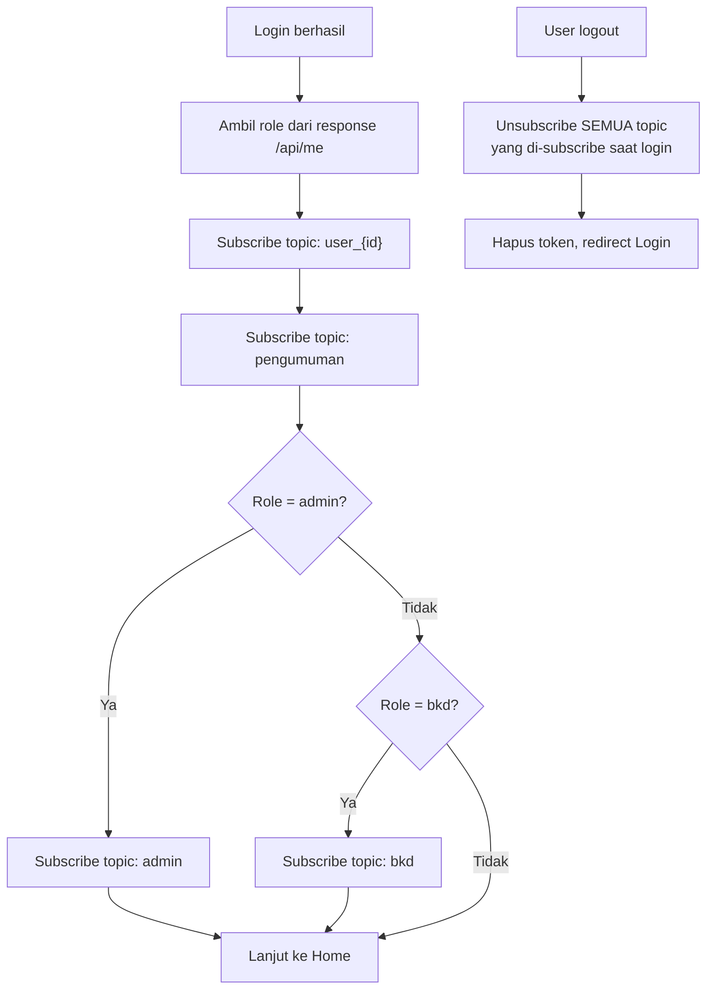

# 📘 Software Requirements Specification (SRS) — Gelatik (Flutter Migration)

## 0. Informasi Dokumen

| Item | Detail |
|---|---|
| **Nama Dokumen** | SRS — Migrasi Gelatik dari Kotlin ke Flutter/Dart + Fitur Baru |
| **Versi Dokumen** | **2.0** (revisi dari v1.0) |
| **Terkait Dokumen** | `prd_gelatik_v2.md`, `DESIGN.md`, Postman Collection backend terpadu (`layanantik-backend-api.postman_collection.json`) |

### Perubahan dari v1.0 ke v2.0
Seluruh kontrak endpoint di dokumen ini diperbarui berdasarkan **backend yang sudah selesai dibangun, diaudit, dan diverifikasi lewat HTTP request nyata** — bukan lagi asumsi endpoint seperti di v1.0. Lihat §7 untuk kontrak final.

---

## 1. Pendahuluan

### 1.1 Tujuan
Menjabarkan kebutuhan teknis rinci migrasi Gelatik dari Kotlin ke Flutter/Dart, termasuk kontrak API final, flow autentikasi yang diperbarui, dan skema notifikasi FCM final.

### 1.2 Ruang Lingkup
Sama seperti v1.0 (12 modul existing + F-WA + F-BOT), dengan tambahan: dokumentasi behavior aktivasi akun, skema FCM topic final, dan kontrak endpoint Peminjaman/Konsultasi yang diperluas.

### 1.3 Definisi, Akronim, dan Istilah

Tidak berubah dari v1.0 — merujuk ke istilah OPD, FCM, Baileys, dst.

### 1.4 Referensi
- `prd_gelatik_v2.md`
- `DESIGN.md` (Modern Minimalist M3, Siger & Pesisir)
- `layanantik-backend-api.postman_collection.json` — **sumber kebenaran kontrak API**, rujuk ini bila ada keraguan detail request/response
- `KONFIGURASI_PRODUCTION.md` (backend)

---

## 2. Deskripsi Umum Sistem

### 2.1 Perspektif Produk
Gelatik adalah salah satu dari dua klien (bersama Website Layanan TIK) yang mengonsumsi **backend terpadu** — satu basis kode Laravel + Node.js yang melayani keduanya. Base URL backend (lokal development): `http://localhost:8000/api`.

### 2.2 Fungsi Produk
Identik dengan v1.0: 12 modul bisnis + F-WA + F-BOT.

### 2.3 Karakteristik Pengguna
Tidak berubah — Pegawai OPD (User) dan Admin.

### 2.4 Batasan Umum
- Kontrak endpoint **wajib** mengikuti Postman Collection final — bukan diasumsikan dari nama fitur.
- Panel Admin Mobile dibatasi ke 3 area (lihat PRD §3.1).

---

## 3. Arsitektur Aplikasi Flutter

Tidak berubah dari v1.0 — Riverpod (state management) + Dio (networking) + Clean Architecture per-feature folder.

```
lib/
├── core/
│   ├── network/       # Dio client, interceptor (attach Bearer token)
│   ├── storage/       # SecureStorage
│   └── theme/         # Sesuai DESIGN.md
├── features/
│   ├── auth/          # M-A — termasuk handling status pending/nonaktif
│   ├── home/          # M-B
│   ├── peminjaman/    # M-C
│   ├── konsultasi/    # M-D
│   ├── internet/      # M-E
│   ├── email/         # M-F
│   ├── kritik_saran/  # M-G
│   ├── info_alat/     # M-H
│   ├── chatbot_lama/  # M-I
│   ├── profil/        # M-J
│   ├── notifikasi/    # M-K — termasuk subscribe topic FCM final
│   ├── admin/         # M-L — 3 area saja
│   ├── whatsapp/      # F-WA
│   └── chatbot_native/# F-BOT
└── shared/
```

---

## 4. Kebutuhan Fungsional — Modul Existing

> Requirement inti (FR-01 s.d. FR-21 dari v1.0) tetap berlaku — modul dan alur bisnisnya **tidak berubah**. Tabel di bawah memperbarui **kolom Endpoint** ke kontrak final yang sudah diaudit; requirement fungsionalnya sendiri tidak berubah dari v1.0.

| ID | Modul | Requirement | Endpoint Final (v2.0) |
|---|---|---|---|
| FR-01 | M-A | Splash: cek token tersimpan → panggil profil → routing role | `GET /api/me` |
| FR-02 | M-A | Login dengan email & password | `POST /api/login` — **lihat FR-35 (baru) untuk handling status nonaktif** |
| FR-03 | M-A | Register dengan pemilihan OPD dari dropdown | `GET /api/opd`, `POST /api/register` — **lihat FR-36 (baru) untuk field lengkap & behavior status** |
| FR-05 | M-B | Slider banner | `GET /api/slider` |
| FR-06 | M-B | 6 menu layanan + status peminjaman terakhir | `GET /api/pinjam` |
| FR-07 | M-C | Cek ketersediaan aset, multi-aset, ajukan peminjaman | `GET /api/item`, `GET /api/items`, `POST /api/pinjam` |
| FR-07a *(baru)* | M-C | Update pengajuan (hanya status Menunggu) | `PUT /api/pinjam/{id}` |
| FR-07b *(baru)* | M-C | Hapus pengajuan (hanya status Menunggu) | `DELETE /api/pinjam/{id}` |
| FR-07c *(baru)* | M-C | Tambah aset ke pengajuan existing | `POST /api/pinjam/{id}` |
| FR-07d *(baru)* | M-C | Hapus 1 aset dari pengajuan | `DELETE /api/pinjam/{p}/item/{id}` |
| FR-07e *(baru)* | M-L | Admin ubah status peminjaman (dengan catatan wajib jika Ditolak) | `POST /api/pinjam/{id}/status` |
| FR-08 | M-D | Buat, list, detail konsultasi + riwayat respon | `GET/POST /api/konsul`, `GET /api/konsul/{id}` — **catatan: ID biasa, bukan hashId seperti disebut v1.0** |
| FR-09 | M-D | Admin beri respon multi-respon | `POST /api/konsul/{id}/response` |
| FR-09a *(baru)* | M-D/M-L | Ubah status konsultasi | `POST /api/konsul/{id}/status` |
| FR-09b *(baru)* | M-D | Hapus konsultasi (soft delete) | `DELETE /api/konsul/{id}` |
| FR-10 | M-E | Info bandwidth OPD, daftar router | `GET /api/list-router-opd` |
| FR-11 | M-E | Pengaduan internet via self-assessment → FAQ → form | `GET /api/faq?topik_id=39`, `POST /api/konsul` |
| FR-12 | M-F | Ajukan email resmi batch | `GET /api/pegawai`, `POST /api/pengajuan-email`, `GET /api/pengajuan-email` |
| FR-13 | M-F/M-L | Verifikasi/approve/reject usulan email | `POST /api/pengajuan-email/{id}/verifikasi`, `.../buat-email-resmi`, `.../tolak-email` |
| FR-14 | M-G | Kirim kritik & saran | `POST /api/kritik-saran` |
| FR-15 | M-H | List alat TIK + empty state | `GET /api/items` |
| FR-16 | M-I | Chatbot AI lama (WebView Chatbase) | `GET /api/chatbot` — return config iframe URL |
| FR-17 | M-J | Profil user + logout | `GET /api/me`, `POST /api/logout` |
| FR-18 | M-K | Subscribe topic FCM + notifikasi custom | **Lihat FR-37 (baru) — skema topic final berbeda dari v1.0** |
| FR-19 | M-L | Admin: list pengajuan peminjaman | `GET /api/pinjam` |
| FR-20 | M-L | Admin: filter & kelola konsultasi | `GET /api/konsul`, `POST /api/konsul/{id}/response` |

---

## 5. Kebutuhan Fungsional — Fitur Baru (F-WA & F-BOT)

### 5.1 F-WA — Notifikasi Real-time WhatsApp

| ID | Requirement | Endpoint |
|---|---|---|
| FR-22 | Daftarkan/perbarui nomor WhatsApp | `POST /api/notifikasi/wa/subscribe` |
| FR-23 | Validasi format nomor sebelum simpan | — (client-side + server-side) |
| FR-24 | Notifikasi WA otomatis saat status Pinjam berubah | Trigger backend, tidak ada endpoint langsung dari klien |
| FR-25 | Notifikasi WA saat ada respon Konsultasi baru | idem |
| FR-26 | Notifikasi WA saat keputusan Usulan Email | idem |
| FR-27 | Kegagalan WA tidak boleh menghentikan FCM | Sudah dijamin di level backend |
| FR-28 | Opt-out kapan saja | `DELETE /api/notifikasi/wa/subscribe` |
| FR-28a *(baru)* | Cek status opt-in saat ini | `GET /api/notifikasi/wa/status` |

### 5.2 F-BOT — Chatbot Native

| ID | Requirement | Endpoint |
|---|---|---|
| FR-29 | Entry point terpisah dari FAB Chatbot lama | — (UI) |
| FR-30 | Jawab pertanyaan umum berbasis FAQ | `POST /api/chatbot/message` |
| FR-31 | Jawab status pengajuan milik user login | idem (backend ambil konteks read-only) |
| FR-32 | Tidak boleh create/update/delete data | Dijamin di level backend |
| FR-33 | Failover Gemini → Groq otomatis | Dijamin di level backend, transparan ke klien |
| FR-34 | Riwayat percakapan dapat diakses ulang | `GET /api/chatbot/history`, `DELETE /api/chatbot/history` |

---

## 6. 🆕 Kebutuhan Fungsional Baru — Behavior Autentikasi & Notifikasi (Ditemukan Saat Implementasi Backend)

### 6.1 Autentikasi

| ID | Requirement |
|---|---|
| FR-35 | Sistem harus menangani response `403` dari `POST /api/login` dengan pesan *"Akun Anda belum aktif atau telah dinonaktifkan."* — tampilkan pesan ini apa adanya ke user, jangan digantikan pesan generik. |
| FR-36 | Form Register wajib mengirim field: `name`, `email`, `username`, `no_hp`, `nama_opd` (tervalidasi terhadap `GET /api/opd`), `password`, `password_confirmation`. Response sukses (`201`) **tidak menyertakan `access_token`** — UI wajib menampilkan pesan bahwa akun perlu diaktifkan admin, dan mengarahkan user kembali ke Login (bukan Home). |

### 6.2 Notifikasi FCM

| ID | Requirement |
|---|---|
| FR-37 | Setelah login sukses, klien harus subscribe ke topic FCM berikut: `user_{id}` (wajib, semua role), `pengumuman` (wajib, semua role), `admin` (hanya jika role = admin), `bkd` (hanya jika role = bkd, kondisional pada apakah BKD punya akses Mobile). |
| FR-38 | Saat logout, klien **harus** unsubscribe dari seluruh topic yang di-subscribe saat login (mencegah notifikasi personal `user_{id}` lama tetap diterima di device setelah user lain login di device yang sama). |

---

## 7. Kebutuhan Antarmuka Eksternal (API) — Kontrak Final

> Kontrak berikut adalah hasil audit final, terverifikasi lewat HTTP request nyata (bukan Tinker/asumsi). **Sumber kebenaran utama tetap Postman Collection** — tabel ini adalah ringkasannya.

### 7.1 Auth & Profil

| Method | Endpoint | Auth |
|---|---|---|
| `POST` | `/api/login` | Publik |
| `POST` | `/api/register` | Publik |
| `GET` | `/api/me` | Bearer |
| `POST` | `/api/logout` | Bearer |
| `GET` | `/api/opd` | Publik |

### 7.2 Peminjaman Aset

| Method | Endpoint | Auth |
|---|---|---|
| `GET` | `/api/pinjam` | Bearer |
| `POST` | `/api/pinjam` | Bearer |
| `GET` | `/api/pinjam/{id}` | Bearer |
| `PUT` | `/api/pinjam/{id}` | Bearer |
| `DELETE` | `/api/pinjam/{id}` | Bearer |
| `POST` | `/api/pinjam/{id}` (tambah aset) | Bearer |
| `DELETE` | `/api/pinjam/{p}/item/{id}` | Bearer |
| `POST` | `/api/pinjam/{id}/status` | Bearer (Admin) |

### 7.3 Konsultasi TIK

| Method | Endpoint | Auth |
|---|---|---|
| `GET` | `/api/konsul` | Bearer |
| `POST` | `/api/konsul` | Bearer |
| `GET` | `/api/konsul/{id}` | Bearer |
| `POST` | `/api/konsul/{id}/response` | Bearer |
| `POST` | `/api/konsul/{id}/status` | Bearer (Admin) |
| `DELETE` | `/api/konsul/{id}` | Bearer |

### 7.4 Item, Topik, FAQ, Router

| Method | Endpoint |
|---|---|
| `GET` | `/api/item`, `/api/items`, `/api/items/{id}`, `/api/items/search/{keyword}` |
| `GET` | `/api/topik`, `/api/faq` |
| `GET` | `/api/list-router-opd` |

### 7.5 Usulan Email Resmi

| Method | Endpoint | Auth |
|---|---|---|
| `GET` | `/api/pegawai` | Bearer |
| `POST` | `/api/pengajuan-email` | Bearer |
| `GET` | `/api/pengajuan-email`, `/api/pengajuan-email/{id}` | Bearer |
| `POST` | `/api/pengajuan-email/{id}/verifikasi` | Bearer (BKD) |
| `POST` | `/api/pengajuan-email/{id}/buat-email-resmi` | Bearer (Admin) |
| `POST` | `/api/pengajuan-email/{id}/tolak-email` | Bearer (Admin) |

### 7.6 Kritik & Saran, Chatbot Lama

| Method | Endpoint |
|---|---|
| `POST` | `/api/kritik-saran` |
| `GET` | `/api/kritik-saran/search` |
| `GET` | `/api/chatbot` |

### 7.7 F-WA & F-BOT (Fitur Baru)

| Method | Endpoint |
|---|---|
| `POST`/`DELETE` | `/api/notifikasi/wa/subscribe` |
| `GET` | `/api/notifikasi/wa/status` |
| `POST` | `/api/chatbot/message` |
| `GET`/`DELETE` | `/api/chatbot/history` |

### 7.8 Opsional (Tersedia, Tidak Wajib Dipakai Rilis Pertama)

| Method | Endpoint | Catatan |
|---|---|---|
| `GET` | `/api/laporan/peminjaman` | F-LAPORAN — lihat PRD §3.3 |
| `GET`/`POST` | `/api/rating` | Tidak eksplisit di scope Kotlin asli |
| `GET`/`POST` | `/api/pengumuman` | idem |

---

## 8. Flow Sistem

> Flow bisnis inti (Peminjaman, Konsultasi, dst.) tidak berubah dari v1.0 — merujuk ke flowchart yang sudah ada. Bagian ini menambahkan 2 flow baru untuk behavior yang teridentifikasi saat implementasi backend.

### 8.1 🆕 Flow Register dengan Aktivasi Admin

```mermaid
flowchart TD
    A["RegisterScreen"] --> B["API: GET /api/opd"]
    B --> C["User isi form:<br/>name, email, username,<br/>no_hp, nama_opd, password"]
    C --> D["API: POST /api/register"]
    D --> E{"Berhasil (201)?"}
    E -->|Tidak| F["Tampilkan error validasi"]
    E -->|Ya| G["Tampilkan pesan:<br/>'Akun akan diaktifkan admin'"]
    G --> H["Redirect ke LoginScreen<br/>(BUKAN Home)"]
    H --> I["User coba login sebelum diaktivasi"]
    I --> J["API: POST /api/login"]
    J --> K{"Status akun?"}
    K -->|Nonaktif| L["403: tampilkan pesan<br/>'akun belum aktif'"]
    K -->|Aktif (setelah admin approve)| M["Login berhasil,<br/>lanjut ke Home"]
```

### 8.2 🆕 Flow Subscribe/Unsubscribe Topic FCM



---

## 9. Model Data Baru (Klien)

Tidak ada tabel database baru dari sisi klien (murni konsumsi API) — model Dart yang perlu dibuat mengikuti struktur response di Postman Collection: `User`, `Pinjam`, `PinjamItem`, `Konsultasi`, `KonsultasiResponse`, `MasterItem`, `UsulanEmail`, `Pengumuman`, `ChatbotMessage`, `WhatsAppSubscription`.

---

## 10. Kebutuhan Non-Fungsional

Tidak berubah dari v1.0 — lihat PRD §7.

---

## 11. Matriks Traceability (Diperbarui)

| Fitur | Requirement ID | Endpoint |
|---|---|---|
| Autentikasi + Aktivasi | FR-01–FR-03, FR-35–FR-36 | `/api/login`, `/api/register`, `/api/opd`, `/api/me` |
| Peminjaman (lengkap) | FR-07, FR-07a–FR-07e | `/api/pinjam*` |
| Konsultasi (lengkap) | FR-08–FR-09, FR-09a–FR-09b | `/api/konsul*` |
| Notifikasi FCM | FR-18, FR-37–FR-38 | Topic-based, tanpa endpoint REST langsung |
| F-WA | FR-22–FR-28a | `/api/notifikasi/wa/*` |
| F-BOT | FR-29–FR-34 | `/api/chatbot/*` |

---

## 12. Ringkasan

> SRS v2.0 ini memperbarui kontrak teknis migrasi Gelatik berdasarkan backend yang **sudah final dan teraudit** — seluruh endpoint pada §7 sudah terverifikasi lewat HTTP request nyata (bukan asumsi), 4 requirement baru ditambahkan untuk menangani behavior yang baru teridentifikasi saat implementasi backend (aktivasi akun oleh admin, skema FCM topic personal), dan kontrak Peminjaman/Konsultasi diperluas mencakup operasi update/hapus yang sebelumnya tidak tercakup di v1.0. Dokumen ini, bersama `DESIGN.md` dan Postman Collection backend, menjadi tiga rujukan utama pengembangan UI Flutter Gelatik.
